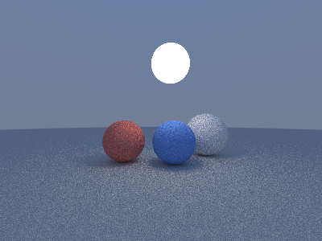

# pathtracer_roc

A small path tracer written in [Roc](https://www.roc-lang.org), split into `roc-image`, `roc-float3`, `roc-float4` and `roc-ray` packages.

```sh
nix develop
roc run main.roc
```

Resolution, depth and sample count are constants at the top of `main.roc`; the result is written to `output.png`.


